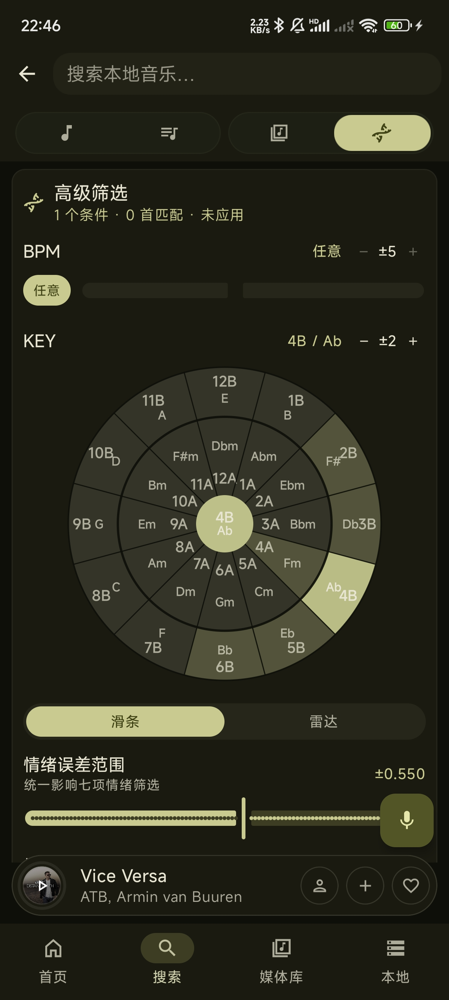
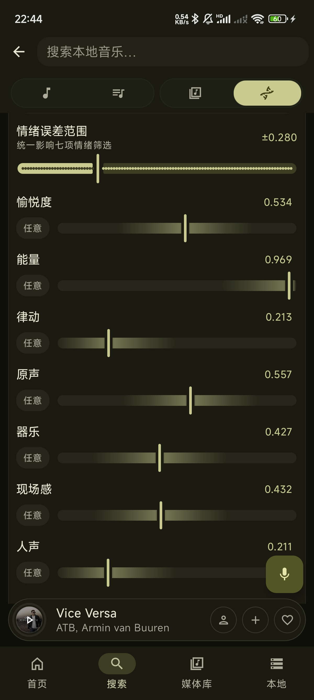
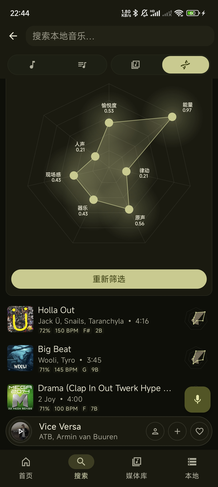
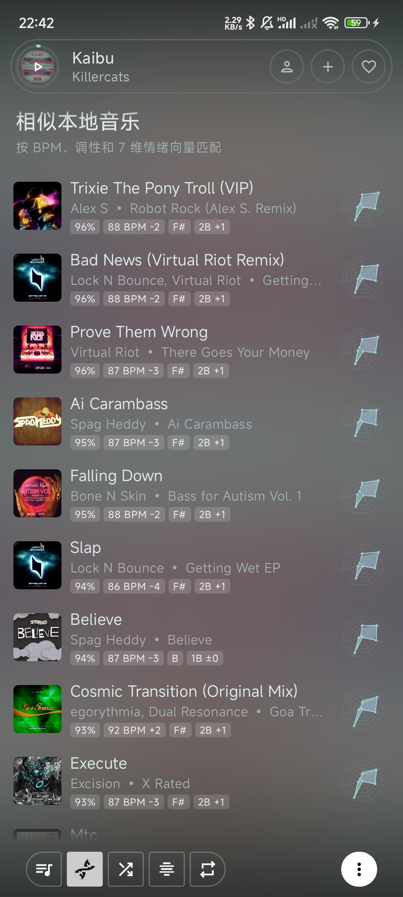
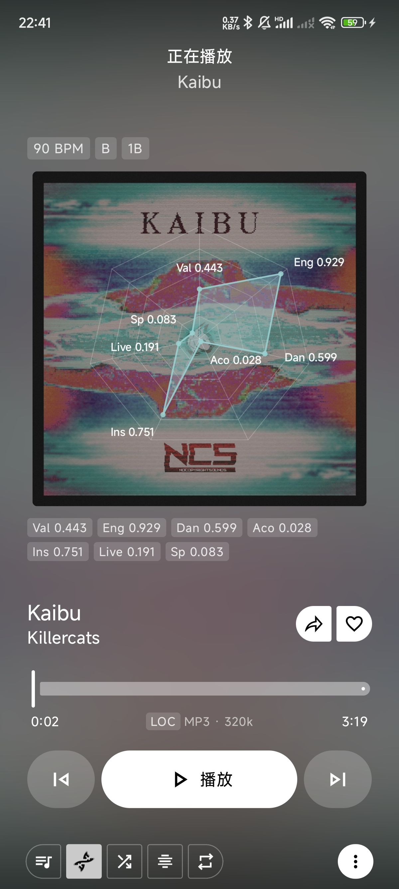
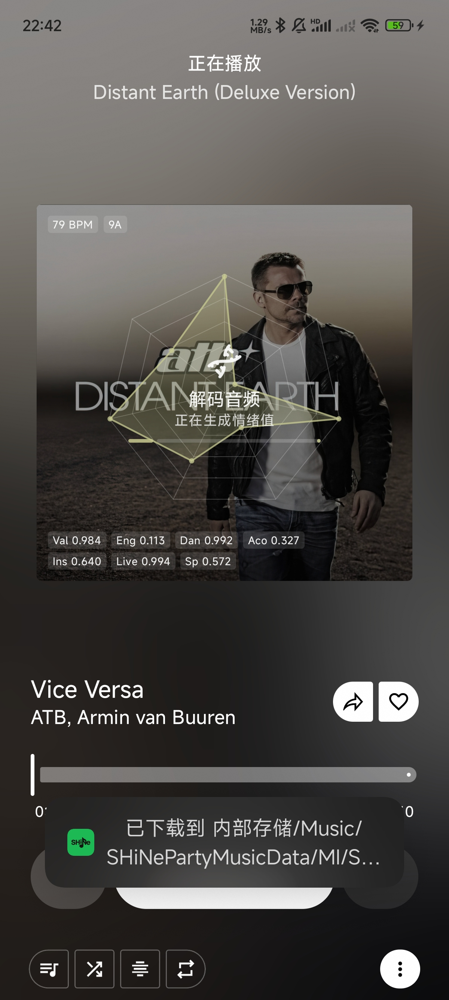

# SHiNe MUSIC

Android 音乐播放器 | 完美适配落雪音乐六音源

---

## 关于本项目

SHiNe MUSIC 是基于 [Metrolist](https://github.com/MetrolistGroup/Metrolist) 深度定制的 Android 音乐播放器。

本项目**继承并改造了 Metrolist 的前端 UI 和整体架构**，在此基础上将后端完全重写，使其全面适配国内音乐平台。**核心目标是打造一款完美支持洛雪音乐（LX Music）六音源的 Android 客户端**，让移动端用户也能享受洛雪音乐带来的多平台音乐体验。

与原始的 SHiNe MUSIC 客户端完全不同，SHiNe MUSIC 已彻底剥离所有 SHiNe 相关功能，专注于国内音乐生态。

---

## 完全适配洛雪音乐六音源

SHiNe MUSIC **已完全适配洛雪音乐（LX Music）的六大音乐平台**，支持以下音乐源：

| 平台 | 说明 |
|------|------|
| **酷狗音乐** | 49 个榜单（TOP500、飙升榜、抖音热歌榜、Billboard 等） |
| **酷我音乐** | 43 个榜单（飙升榜、新歌榜、热歌榜、iTunes、SHiNe 等） |
| **网易云音乐** | 41 个榜单（飙升榜、新歌榜、原创榜、ACG、韩语、俄语等） |
| **QQ 音乐** | 25 个榜单（流行指数榜、热歌榜、新歌榜、说唱榜、电音榜等） |
| **咪咕音乐** | 22 个榜单（新歌榜、热歌榜、港台榜、内地榜、Billboard、Melon 等） |
| **聚合模式** | 同时搜索全部 5 个平台，自动去重合并结果 |

### 音乐源获取方式

软件已完美兼容洛雪音乐源格式，获取音乐源请访问：

> **https://github.com/guoyue2010/lxmusic-/tree/main**

在应用内 **设置 → 音乐源管理** 中配置：

- **URL 导入**：粘贴洛雪音乐源 JS 脚本链接，自动提取配置
- **文件导入**：选择本地洛雪音乐 `.js` 源文件，自动解析
- **手动输入**：填写 API 地址和密钥

一行代码、一个链接即可完成配置，享受洛雪六音源的全部内容。

---

## 功能

### 播放
- 多音质选择（标准 / 高品质 / 极高品质）
- 变速播放（速度与音调调节）
- 定时关闭（支持淡出、当前歌曲播完后停止、定时重复）
- 音乐闹钟
- 断点续播（队列持久化，重启不丢失）
- 蓝牙连接自动续播

### 音效
- 10+ 段参数均衡器
- AutoEQ 耳机预设（从 GitHub 自动匹配你的耳机型号）
- EQ 配置文件保存/管理
- 音量归一化

### 歌词
- 7+ 歌词源（LrcLib、BetterLyrics、酷狗、网易云等）
- 时间同步滚动歌词
- AI 歌词翻译（DeepL、Mistral、OpenRouter，支持流式输出）
- 歌词罗马音标注（日语、韩语、中文等多语言支持）
- 歌词手动微调同步

### 下载
- 多音质离线下载
- 自定义下载目录
- 内嵌元数据和封面
- 下载到真实本地文件后自动纳入本地音乐库

### 音乐分析与智能推荐
- 本机端音乐分析：自动提取 BPM、调性和 7 维情绪向量（愉悦度、能量、律动、原声、器乐、现场感、人声）
- MP3 标签写入：将 BPM、Key 和情绪值写回文件标签，重新扫描也能恢复分析数据
- 高级本地搜索：按 BPM 误差、Camelot 五度循环调性、7 维情绪滑条或雷达图精准筛选
- 情绪雷达图：播放器封面、本地音乐卡片、相似推荐和高级筛选结果均可显示雷达图
- 相似本地音乐：基于 BPM、调性和情绪向量匹配，并显示相似度、BPM 差值和 Key 差值
- 推荐播放模式：播放本地音乐时可按相似度递归选择下一首，并带有随 BPM 呼吸的动态图标
- 下载并分析：网络歌曲可一键下载到本地并分析，之后可参与本地相似推荐和高级筛选

### 数据统计
- 详细听歌统计（多时间范围筛选）
- 年度 Wrapped 报告（类似 Spotify Wrapped 的动画幻灯）

### 歌词评论
- 酷狗 / 酷我 / QQ 音乐热门评论

### 集成
- Discord Rich Presence（显示当前播放、自定义按钮）
- Last.fm 记录

---

## 截图

<table>
<tr>
<td></td>
<td></td>
<td></td>
</tr>
<tr>
<td></td>
<td></td>
<td></td>
</tr>
<tr>
<td></td>
<td></td>
<td></td>
</tr>
<tr>
<td></td>
</tr>
<tr>
<td></td>
<td></td>
<td></td>
</tr>
<tr>
<td></td>
<td></td>
<td></td>
</tr>
</table>

