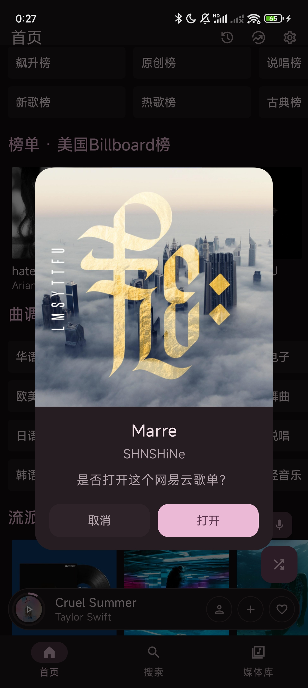
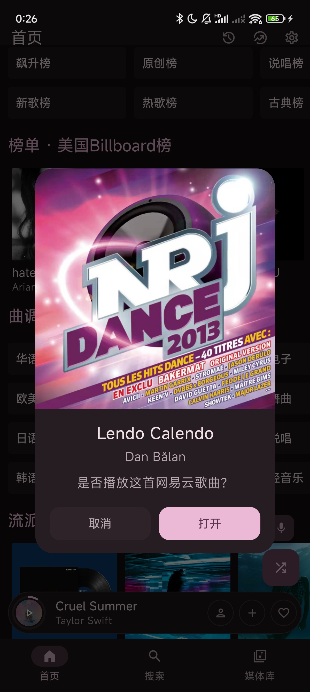
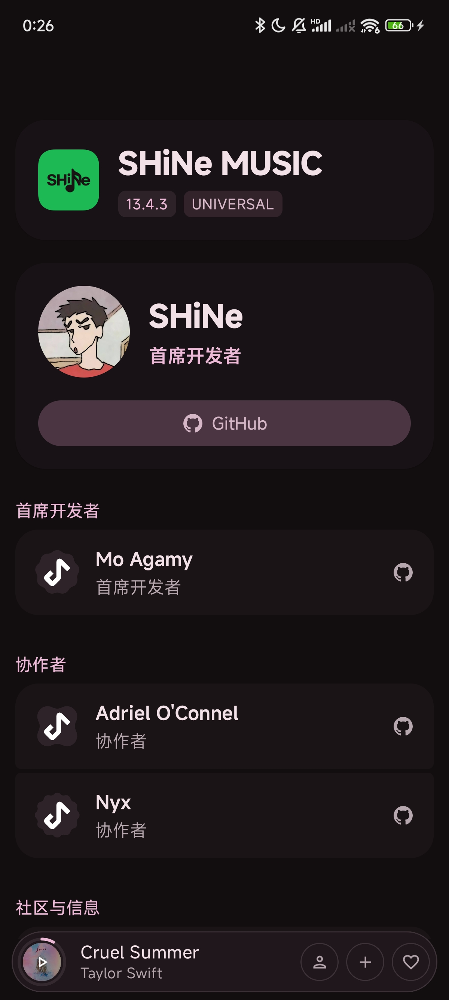
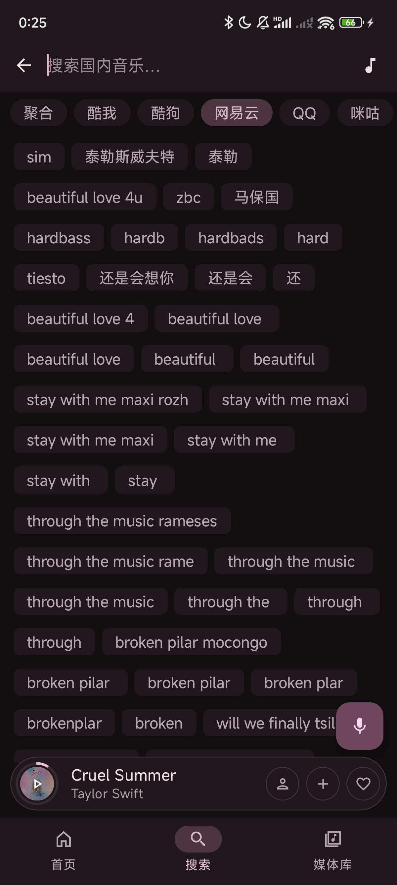
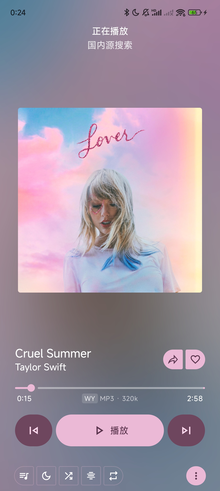
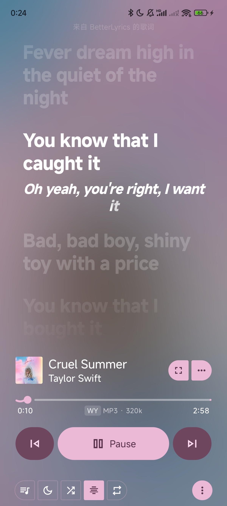
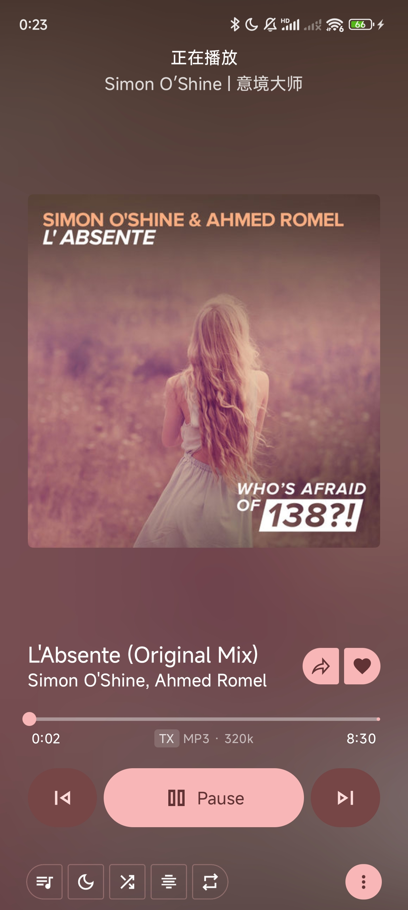
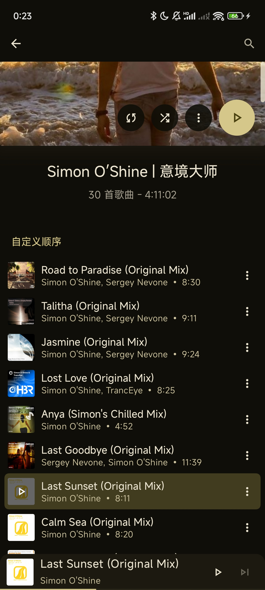
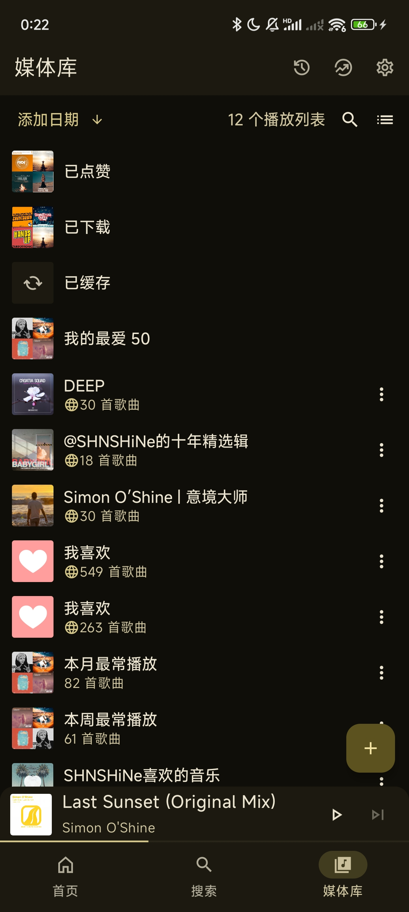
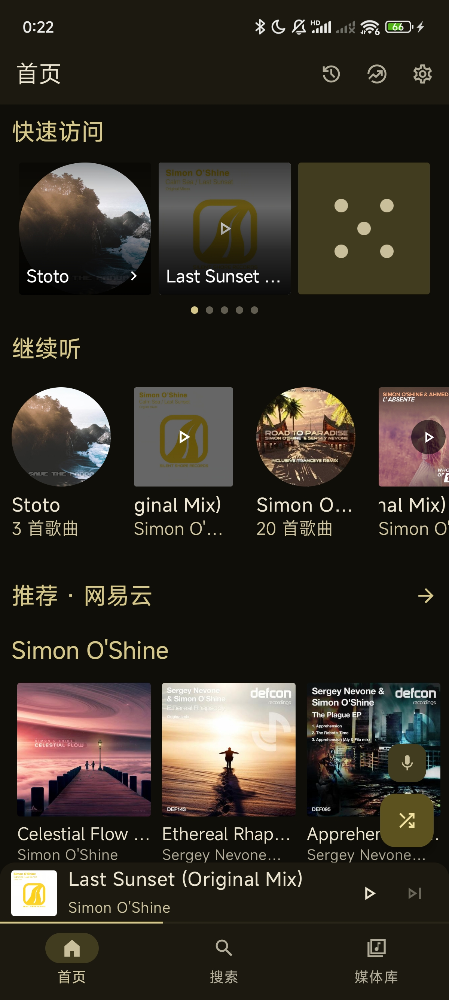

# SHiNe MUSIC

Android 多平台音乐播放器

---

## 关于本项目

本项目基于 [Metrolist](https://github.com/MetrolistGroup/Metrolist) 的 Material 3 UI 框架深度修改而来。后端功能已完全重写，与 YouTube Music 无任何关联。仅继承并改造了其 UI 界面。

---

## 音乐源

SHiNe MUSIC 支持以下音乐平台，可在应用内自由切换：

| 平台 | 说明 |
|------|------|
| **酷狗音乐** | 49 个榜单（TOP500、飙升榜、抖音热歌榜、Billboard 等） |
| **酷我音乐** | 43 个榜单（飙升榜、新歌榜、热歌榜、iTunes、YouTube 等） |
| **网易云音乐** | 41 个榜单（飙升榜、新歌榜、原创榜、ACG、韩语、俄语等） |
| **QQ 音乐** | 25 个榜单（流行指数榜、热歌榜、新歌榜、说唱榜、电音榜等） |
| **咪咕音乐** | 22 个榜单（新歌榜、热歌榜、港台榜、内地榜、Billboard、Melon 等） |
| **聚合模式** | 同时搜索全部 5 个平台，自动去重合并结果 |

### 音乐源获取方式

在应用内 **设置 → 音乐源管理** 中配置自定义后端 API：

- **手动输入**：填写 API 地址和密钥
- **URL 导入**：粘贴 LX-Music 格式的 JS 脚本链接，自动提取配置
- **文件导入**：选择本地 `.js` 文件自动解析

应用通过各平台公开 API 进行搜索和浏览，实际播放链接由你配置的后端 API 提供。

---

## 功能

### 播放
- 多音质选择（标准 / 高品质 / 极高品质）
- 变速播放（速度与音调调节）
- 定时关闭（支持淡出、当前歌曲播完后停止、定时重复）
- 音乐闹钟
- 断点续播（队列持久化，重启不丢失）
- 蓝牙连接自动续播

### 音效
- 10+ 段参数均衡器
- AutoEQ 耳机预设（从 GitHub 自动匹配你的耳机型号）
- EQ 配置文件保存/管理
- 音量归一化

### 歌词
- 7+ 歌词源（LrcLib、BetterLyrics、酷狗、网易云等）
- 时间同步滚动歌词
- AI 歌词翻译（DeepL、Mistral、OpenRouter，支持流式输出）
- 歌词罗马音标注（日语、韩语、中文等多语言支持）
- 歌词手动微调同步

### 下载
- 多音质离线下载
- 自定义下载目录
- 内嵌元数据和封面

### 数据统计
- 详细听歌统计（多时间范围筛选）
- 年度 Wrapped 报告（类似 Spotify Wrapped 的动画幻灯）

### 歌词评论
- 酷狗 / 酷我 / QQ 音乐热门评论

### 集成
- Discord Rich Presence（显示当前播放、自定义按钮）
- Last.fm 记录

---

## 截图

